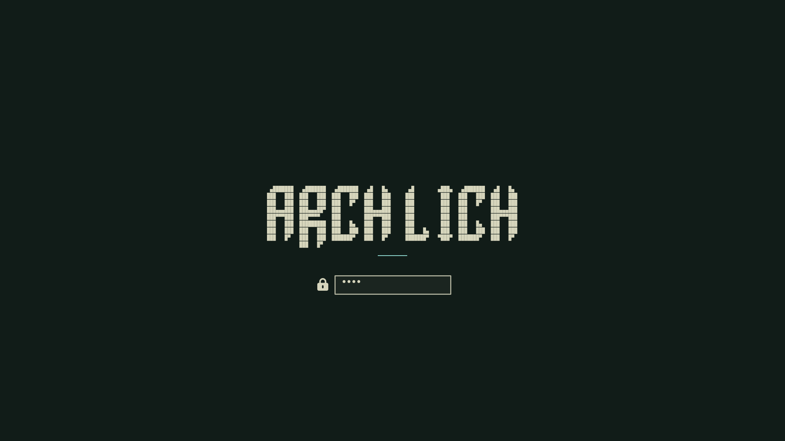

# Osaka Jade Rice

An Osaka Jade Omarchy desktop with a custom Arch Lich lock screen, translucent
windows, coordinated terminals, and a randomized undead Fastfetch gallery.



## What is included

- Osaka Jade theme overlay and four 1440p/4K wallpapers
- Custom Quickshell lock service with password and fingerprint flows
- Minimal animated “Welcome back, Commander.” overlay after desktop startup
- Arch Lich lock, screensaver, SDDM, and Plymouth artwork
- Omarchy shell layout and idle timing
- Hyprland blur, Kitty opacity, and RuneLite rules
- Alacritty, Foot, Ghostty, and Kitty configs
- Fastfetch config, `undead-fetch`, and the full undead sprite directory
- An optional monitor profile for the original machine
- Safe backups, automatic validation, semantic versions, and maintainer auto-sync

## Requirements

- [Omarchy](https://omarchy.org/) 4.x
- Git, `jq`, and `rsync` (included with current Omarchy)
- `inotify-tools` only if you enable maintainer auto-sync

The terminal setup expects `JetBrainsMono Nerd Font`, which Omarchy installs by
default. Fingerprint unlock appears only on systems with an enrolled sensor.

## Install

Clone the repository and run the installer:

```bash
git clone https://github.com/XadniGraves/osaka-jade-rice.git
cd osaka-jade-rice
./install.sh
```

The installer backs up every replaced user file under
`~/.local/state/osaka-jade-rice/backups/`, installs the portable user-level
rice, applies Osaka Jade, selects the current wallpaper, and reloads supported
components.

### Optional original-machine display profile

Display scale is hardware-specific, so it is intentionally skipped by default.
Use the bundled profile only on a matching display setup:

```bash
./install.sh --profile primary
```

### Optional SDDM and Plymouth branding

The boot and login artwork writes system files and rebuilds the initramfs, so it
is an explicit opt-in and will prompt for `sudo`:

```bash
./install.sh --system-branding
```

Options can be combined:

```bash
./install.sh --profile primary --system-branding
```

Preview changes without writing anything:

```bash
./install.sh --dry-run --profile primary --system-branding
```

## Welcome overlay

The `xadni.welcome` shell plugin is triggered by Omarchy's `post-boot` hook. It
enters over 480 ms, holds “Welcome back, Commander.” for three seconds, then
leaves with the reverse motion over 420 ms. Its full-screen layer is visual
only and does not intercept clicks or keyboard focus.

Preview it without rebooting:

```bash
omarchy shell welcome show
```

The message and timing live in
`config/omarchy/plugins/xadni.welcome/Welcome.qml`.

## Update another PC

```bash
cd osaka-jade-rice
git pull --ff-only
./install.sh
```

Re-add `--profile primary` or `--system-branding` only if that machine uses
those optional pieces.

## Automatic maintainer sync

This is intended for the main editing PC, not every machine that installs the
rice. It watches the managed live files, waits for 30 quiet seconds, snapshots
them, creates a SemVer patch release with a clear changelog entry, and pushes it
to `origin`. It also retries every 15 minutes so temporary network failures do
not leave the repository behind.

After GitHub authentication and the first push:

```bash
./scripts/enable-sync.sh
```

Check it with:

```bash
./scripts/sync-status.sh
```

Disable it with:

```bash
./scripts/disable-sync.sh
```

System-branding changes are deliberately not watched because an Omarchy package
update can rewrite those paths. After intentionally editing SDDM or Plymouth,
capture them with:

```bash
./scripts/sync.sh --system
```

## Versioning and commits

- Releases follow `MAJOR.MINOR.PATCH` in `VERSION` and Git tags.
- Automatic live-file snapshots increment `PATCH`.
- Planned feature work should increment `MINOR`; breaking installer/layout
  changes should increment `MAJOR`.
- Automated commits use `chore(sync): update rice snapshot (vX.Y.Z)`.

## Layout

```text
config/              Files installed under ~/.config
data/undead-sprites/ Fastfetch image gallery installed under ~/.local/share
home/                Home-directory files and helper commands
profiles/primary/    Optional machine-specific monitor config
system/              Optional root-level SDDM/Plymouth overlays
manifest/            Explicit allowlists used by install and sync scripts
scripts/             Snapshot, validation, and automatic sync tools
```

## Recovery

Each install prints its timestamped backup directory. To recover a file, copy
the matching path from that directory back into your home directory. System
branding backups are stored in the same backup tree under `system/`.

## Asset and upstream notes

See [ASSETS.md](ASSETS.md). The lock service is based on Omarchy's
MIT-licensed `omarchy.lock`; wallpapers retain their original creators' rights.
